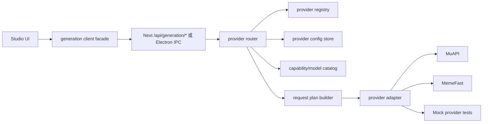

# API 供应商可切换适配层执行方案

> 目标：做成供应商适配层，支持 MuAPI、MemeFast 和后续供应商随时切换，而不是一次性替换 URL。

## 结论

这件事不能做成“把 MuAPI 的 URL 和 header 改成 MemeFast”。正确方案是把 Open-Generative-AI 现在散落在 `muapi.js`、Next API route、Vite proxy、Studio 组件里的供应商假设收口成一个稳定的内部协议：

```text
Studio UI -> generation client facade -> provider router -> provider adapter -> external provider
```

第一步先把现有 MuAPI 原样包进 `muapi` adapter，保证现有图片、视频、音频、上传、workflow、agents 行为不变。第二步再把 MemeFast 作为第二个 adapter 接入。同一个 UI 只提交内部 `GenerationRequest`，切换供应商只改配置和 feature binding，不改业务组件。

生产环境下，外部供应商 key、baseUrl、默认供应商选择应该放在服务端适配层里。当前项目已有 Next `app/api/*` 代理，可以作为 Web 版后端；Electron/file 直连场景要么继续 BYOK 过渡，要么补 Electron main IPC 代理。不要把平台主 key 放进浏览器。

## 当前 MuAPI 绑定点

| 文件 | 当前职责 | 迁移处理 |
| --- | --- | --- |
| `packages/studio/src/muapi.js` | MuAPI 客户端核心。`submitAndPoll(endpoint, payload, key)` 走 `POST /api/v1/{endpoint}`，再轮询 `GET /api/v1/predictions/{request_id}/result`。图片、视频、音频、上传、workflow、agents 都在这里。 | 第一阶段改成兼容 facade，内部调用 `providers/muapi/adapter.js`。外部导出函数名先不变。 |
| `packages/studio/src/models.js` | 保存 model 到 endpoint、字段名、输入能力的映射。 | 拆成 provider-aware catalog。MuAPI catalog 保持原映射；MemeFast catalog 由 sync/pricing 生成。 |
| `components/StandaloneShell.js` | 保存 `muapi_key` 到 localStorage/cookie，axios interceptor 给 `/api/*` 加 `x-api-key`。 | 改成 provider settings：`providerId + baseUrl + apiKey(s)`。保留 `muapi_key` 迁移兼容。 |
| `app/api/api/v1/[[...path]]/route.js` | 代理 `/api/api/v1/* -> https://api.muapi.ai/api/v1/*`。 | 不再作为通用业务入口，只作为 MuAPI legacy proxy 保留。新增 `/api/generation/*`。 |
| `app/api/workflow/[[...path]]/route.js` | 代理 MuAPI workflow。 | 标记为 MuAPI-only capability。MemeFast 不支持时 UI 隐藏或禁用。 |
| `app/api/agents/[[...path]]/route.js` | 代理 MuAPI agents。 | 标记为 MuAPI-only capability。 |
| `app/api/app/[[...path]]/route.js` | 代理 MuAPI app。 | 标记为 MuAPI-only capability。 |
| `app/api/v1/get_upload_url/route.js` | MuAPI 上传相关代理。 | 上传必须进入 provider adapter，不能和 generation request builder 混在一起。 |
| `middleware.js` | 把部分 `/api/*` 流量 rewrite 到 `https://api.muapi.ai`。 | 新接口走 provider route 后，逐步减少 middleware 对 MuAPI 的硬编码。 |
| `vite.config.mjs` | Vite dev proxy `/api -> https://api.muapi.ai`。 | 只保留 legacy。新 provider 路由不依赖 Vite proxy 直通上游。 |

## 从 Moyin MemeFast 直接复用的设计

参考仓库：`G:\moyin-creator-seedance`

| Moyin 文件 | 可复用点 | 在本项目落点 |
| --- | --- | --- |
| `src/stores/api-config-store.ts` | `providers`、`featureBindings`、`syncProviderModels(providerId)`、`modelEndpointTypes`、`modelTypes`、`modelTags`、`modelEnableGroups`。MemeFast 先取公开 `/api/pricing_new`，再按 key 调 `/v1/models` 合并可用模型。 | 新建 `packages/studio/src/providers/provider-config.js` 和 `model-catalog.js`。 |
| `src/lib/ai/feature-router.ts` | 通过 feature binding 找 provider/model，支持多 binding 和轮询。UI 不关心供应商。 | 新建 `packages/studio/src/providers/feature-router.js`。 |
| `src/lib/generation-orchestrator/contract.ts` | 稳定内部协议：`GenerationOperation`、`GenerationRequest`、`GenerationCapability`、`GenerationRequestPlan`。 | 新建 `packages/studio/src/providers/types.js`。JS 项目用 JSDoc typedef 即可，不强行改 TS。 |
| `src/lib/generation-orchestrator/capability-catalog.ts` | 用 capability manifest 判断模型属于 image/video/audio/text、支持哪些操作、哪些面板可用。 | 新建 `packages/studio/src/providers/capability-catalog.js`。 |
| `src/lib/generation-orchestrator/request-plan.ts` | 把内部 request 转成供应商 endpoint/body。这里是 MemeFast 的核心，不是简单拼 URL。 | 新建 `packages/studio/src/providers/memefast/request-plan.js`。只复制已经验证过的 family builder。 |
| `src/lib/generation-orchestrator/submit.ts` | 提交前 admission check，提交/轮询超时策略，统一错误和日志。 | 新建 `packages/studio/src/providers/orchestrator.js`。 |
| `src/lib/generation-orchestrator/polling.ts` | 通用 task polling。 | 新建 `packages/studio/src/providers/polling.js`。 |
| `src/lib/memefast-key-routing.ts` | MemeFast 多 key 根据 `/v1/models` 可见性和 `enable_groups` 选 key。 | 新建 `packages/studio/src/providers/memefast/key-routing.js`。 |

不要把 Moyin 文件整段盲拷进去。要复制的是分层和经过验证的 request-plan family：配置、绑定、能力、请求计划、提交、轮询、归一化。UI 层不要复制 Moyin 的业务面板。

## 目标架构



核心原则：

1. UI 只认识内部 operation：`chat`、`vision`、`t2i`、`i2i`、`t2v`、`i2v`、`v2v`、`lipsync`、`music`、`tts`。
2. 供应商差异只存在于 adapter 和 request-plan。
3. 上传、提交、轮询、结果归一化分开实现。
4. Workflow、Agents、App 这类 MuAPI 私有功能必须作为 capability，不要伪装成所有供应商都支持。
5. Web 生产走 Next API route，key 留在服务端；本地个人版可以保留 BYOK，但配置也要 provider-aware。

## 内部协议

新增内部请求对象。字段名稳定，后续供应商只映射它，不反向污染 UI。

```js
/**
 * @typedef {'text'|'image'|'video'|'audio'|'workflow'|'agent'|'app'} GenerationMediaType
 * @typedef {'chat'|'vision'|'responses'|'analysis'|'t2i'|'i2i'|'t2v'|'i2v'|'v2v'|'lipsync'|'music'|'tts'|'workflow_run'|'agent_chat'} GenerationOperation
 *
 * @typedef {Object} GenerationRequest
 * @property {GenerationMediaType} mediaType
 * @property {GenerationOperation} operation
 * @property {string} modelId
 * @property {string=} prompt
 * @property {string=} providerId
 * @property {Object=} inputs
 * @property {string[]=} inputs.imageUrls
 * @property {string=} inputs.videoUrl
 * @property {string=} inputs.audioUrl
 * @property {string=} inputs.aspectRatio
 * @property {string=} inputs.resolution
 * @property {number=} inputs.duration
 * @property {number=} inputs.seed
 * @property {Object=} inputs.raw
 */
```

标准提交结果：

```js
/**
 * @typedef {Object} GenerationSubmitResult
 * @property {string} providerId
 * @property {string=} taskId
 * @property {'queued'|'running'|'succeeded'|'failed'} status
 * @property {string[]=} urls
 * @property {Object=} raw
 */
```

标准轮询结果：

```js
/**
 * @typedef {Object} GenerationTaskResult
 * @property {string} providerId
 * @property {string} taskId
 * @property {'queued'|'running'|'succeeded'|'failed'} status
 * @property {string[]=} urls
 * @property {string=} errorMessage
 * @property {Object=} raw
 */
```

Adapter 约定：

```js
/**
 * @typedef {Object} ProviderAdapter
 * @property {string} id
 * @property {string} displayName
 * @property {(request: GenerationRequest, context: ProviderContext) => ProviderRequestPlan} buildRequestPlan
 * @property {(plan: ProviderRequestPlan, context: ProviderContext) => Promise<GenerationSubmitResult>} submit
 * @property {(task: ProviderTaskRef, context: ProviderContext) => Promise<GenerationTaskResult>} poll
 * @property {(file: File|Blob, context: ProviderContext, onProgress?: Function) => Promise<string>} upload
 * @property {(error: unknown) => ProviderError} normalizeError
 */
```

Provider context：

```js
/**
 * @typedef {Object} ProviderContext
 * @property {string} providerId
 * @property {string} baseUrl
 * @property {string=} apiKey
 * @property {string[]=} apiKeys
 * @property {'server'|'browser-byok'|'electron'} runtime
 * @property {AbortSignal=} signal
 */
```

## 配置和切换规则

### 统一供应商切换硬约束

用户选择的 `selectedProviderId` 必须是全局默认供应商，不是某个页面的局部开关。选择 `memefast` 后，文字、图片、视频、音频默认都应先从 MemeFast 的模型库存里找可用模型并通过 MemeFast adapter 执行。

核心规则：

1. `selectedProviderId=memefast` 时，`text:*`、`image:*`、`video:*`、`audio:*` 默认 provider 都是 `memefast`。
2. `featureBindings` 只负责在当前 provider 下选择模型，不应反过来把 provider 静默切回 MuAPI。
3. 如果当前 provider 没有支持某个 operation 的模型，UI 应显示“当前供应商不支持/未配置模型”，不能自动 fallback 到另一个供应商。
4. 跨供应商 fallback 只能来自显式配置，例如 `explicitFeatureOverrides`，并且要在设置页可见。
5. Workflow、Agents、App 这类 MuAPI 私有能力可以作为显式例外，但不能影响文字、图片、视频的全局切换语义。

调度目标不是“多个入口分别调不同供应商”，而是：

```text
selectedProviderId=memefast
  -> text/chat/vision/responses/analysis 走 memefast
  -> image/t2i/i2i                      走 memefast
  -> video/t2v/i2v/v2v/lipsync           走 memefast
  -> audio/music/tts                     走 memefast，前提是库存存在可用模型
  -> workflow/agent/app                  只有显式 MuAPI-only 例外才走 MuAPI
```

### 配置来源优先级

1. 请求里显式传入 `providerId` 和 `modelId`。只允许批处理、调试、管理员任务使用，普通 UI 不应滥用。
2. 显式例外：`explicitFeatureOverrides[mediaType:operation]`，用于 MuAPI-only 的 workflow/agent/app 或人工指定的跨供应商任务。
3. 全局选择：`selectedProviderId`。这是文字、图片、视频、音频的默认供应商来源。
4. 当前供应商下的模型绑定：`providerDefaults[selectedProviderId][mediaType:operation]`。
5. 服务端默认环境变量：`GENAI_DEFAULT_PROVIDER`，当前默认必须是 `memefast`。
6. legacy 兼容：存在 `muapi_key` 时只迁移旧 key，不改变默认供应商；MuAPI 只能显式选择。

### 建议环境变量

```env
GENAI_DEFAULT_PROVIDER=memefast

GENAI_MUAPI_BASE_URL=https://api.muapi.ai
GENAI_MUAPI_API_KEY=

GENAI_MEMEFAST_BASE_URL=https://memefast.top
GENAI_MEMEFAST_API_KEY=
GENAI_MEMEFAST_API_KEYS=

GENAI_PROVIDER_MODE=server
```

`GENAI_PROVIDER_MODE=server` 时，前端只提交内部 request，不接触真实 key。个人本地版可以允许 `browser-byok`，但 localStorage/cookie 必须从 `muapi_key` 升级为 provider-aware：

```json
{
  "selectedProviderId": "memefast",
  "providerSwitchMode": "global",
  "allowSilentProviderFallback": false,
  "providers": [
    {
      "id": "muapi",
      "baseUrl": "https://api.muapi.ai",
      "apiKeyStorageRef": "byok:muapi"
    },
    {
      "id": "memefast",
      "baseUrl": "https://memefast.top",
      "apiKeyStorageRef": "byok:memefast"
    }
  ],
  "providerDefaults": {
    "memefast": {
      "text:chat": ["memefast:<synced-text-model>"],
      "text:vision": ["memefast:<synced-vision-model>"],
      "image:t2i": ["memefast:<synced-image-model>"],
      "image:i2i": ["memefast:<synced-image-edit-model>"],
      "video:t2v": ["memefast:<synced-video-model>"],
      "video:i2v": ["memefast:<synced-image-to-video-model>"],
      "audio:tts": ["memefast:<synced-tts-model>"]
    },
    "muapi": {
      "image:t2i": ["muapi:<legacy-image-model>"],
      "video:t2v": ["muapi:<legacy-video-model>"]
    }
  },
  "explicitFeatureOverrides": {
    "workflow:workflow_run": {
      "bindings": ["muapi:workflow"],
      "reason": "muapi-only capability"
    },
    "agent:agent_chat": {
      "bindings": ["muapi:agent"],
      "reason": "muapi-only capability"
    }
  }
}
```

## 新文件结构

```text
packages/studio/src/providers/
  types.js
  registry.js
  provider-config.js
  feature-router.js          // resolveGenerationTarget 在这里，统一决定 provider/model
  capability-catalog.js
  model-catalog.js
  model-inventory.js
  model-metadata-store.js
  model-snapshot-store.js
  orchestrator.js
  polling.js
  normalizers.js
  http.js
  muapi/
    adapter.js
    request-plan.js
    catalog.js
  memefast/
    adapter.js
    request-plan.js
    model-sync.js
    key-routing.js
    catalog.js
  mock/
    adapter.js

packages/studio/src/generation-client.js
packages/studio/src/muapi.js

app/api/generation/submit/route.js
app/api/generation/tasks/[taskId]/route.js
app/api/generation/upload/route.js
app/api/providers/route.js
app/api/providers/test/route.js
app/api/providers/sync-models/route.js
```

`packages/studio/src/muapi.js` 不要第一轮删除。它先变成兼容层，继续导出 `generateImage`、`generateVideo`、`uploadFile` 等老函数，内部调用 `generation-client.js`。这样 Studio 组件可以逐步迁移，不需要一次性大爆炸重构。

## 执行阶段

### 阶段 0：冻结现状

目标：任何重构前先证明 MuAPI 现有行为没有被破坏。

任务：

1. 为 `packages/studio/src/muapi.js` 加最小 contract tests。
2. stub `fetch` 和 `XMLHttpRequest`，验证：
   - 图片提交仍是 `POST /api/v1/{endpoint}`。
   - header 仍有 `x-api-key`。
   - 返回 `request_id` 后仍轮询 `/api/v1/predictions/{id}/result`。
   - `outputs[0]`、`url`、`output.url` 都能归一到 `url`。
   - 上传仍返回 `url/file_url/data.url`。
3. 记录 current behavior fixture，后续 adapter 必须通过同一批 fixture。

建议测试文件：

```text
tests/provider-adapter/muapi-legacy-contract.test.mjs
tests/provider-adapter/fixtures/muapi-submit-success.json
tests/provider-adapter/fixtures/muapi-poll-success.json
```

### 阶段 1：建立内部协议和 registry

目标：先有“插座”，再插供应商。

任务：

1. 新增 `providers/types.js`，用 JSDoc typedef 固化 `GenerationRequest`、`ProviderAdapter`、`ProviderContext`。
2. 新增 `providers/registry.js`，只提供：
   - `registerProvider(adapter)`
   - `getProviderAdapter(providerId)`
   - `listProviderAdapters()`
3. 新增 `providers/normalizers.js`，统一输出：
   - `normalizeStatus(rawStatus)`
   - `extractUrls(raw)`
   - `normalizeProviderError(error)`
4. 新增 `providers/polling.js`，接受 adapter 的 `poll` 函数和策略，不关心供应商。
5. 新增 `providers/mock/adapter.js`，用于测试 registry、orchestrator、route，不依赖真实外部 API。

退出条件：

```powershell
node --test tests/provider-adapter/*.test.mjs
```

### 阶段 2：把 MuAPI 包进 adapter

目标：MuAPI 是第一个 adapter，行为必须和现状一致。

任务：

1. 把 `submitAndPoll` 拆成：
   - `providers/muapi/request-plan.js`：从内部 request 映射到 `{ endpointPath, body, pollPolicy }`。
   - `providers/muapi/adapter.js`：执行 submit、poll、upload。
2. `muapi/request-plan.js` 继续读取当前 `models.js` 映射，保证 endpoint 和字段不变。
3. `muapi/adapter.js` 保留认证方式：`x-api-key`。
4. `providers/muapi/catalog.js` 标明：
   - `image/t2i/i2i`
   - `video/t2v/i2v/v2v/lipsync`
   - `audio/music/tts`
   - `workflow/agent/app` 为 MuAPI-only。
5. `packages/studio/src/muapi.js` 改成 facade：
   - 接收旧参数。
   - 转成 `GenerationRequest`。
   - 调用 `generation-client.js`。
   - 返回旧格式，保证调用方不炸。

退出条件：

1. 阶段 0 tests 全通过。
2. `rg "https://api.muapi.ai" packages/studio/src app -n` 中只允许出现在 `muapi/adapter.js`、legacy proxy、server config。

### 阶段 3：新增服务端 generation route

目标：Web 版外部供应商调用统一从后端走，前端不再知道上游 URL。

新增接口：

```http
POST /api/generation/submit
GET  /api/generation/tasks/:taskId?providerId=memefast
POST /api/generation/upload
GET  /api/providers
POST /api/providers/test
POST /api/providers/sync-models
```

`POST /api/generation/submit` 请求：

```json
{
  "mediaType": "image",
  "operation": "t2i",
  "modelId": "doubao-seedream-5-0-260128",
  "prompt": "cinematic portrait",
  "inputs": {
    "aspectRatio": "16:9",
    "resolution": "1280x720"
  }
}
```

标准响应：

```json
{
  "success": true,
  "data": {
    "providerId": "memefast",
    "taskId": "task_xxx",
    "status": "queued",
    "urls": [],
    "raw": {}
  }
}
```

错误响应：

```json
{
  "success": false,
  "error": {
    "code": "provider_auth_failed",
    "message": "Provider authentication failed",
    "providerId": "memefast"
  }
}
```

关键要求：

1. route 只解析请求，provider/model 必须交给 `resolveGenerationTarget` 解析，再调用 orchestrator。
2. 普通 UI 请求可以传 `modelId`，但不应传 `providerId`；provider 来自 `selectedProviderId`。
3. 管理员/批处理如需跨供应商执行，必须显式传 `providerOverrideReason`，并写入日志。
4. 不在 route 里写 MuAPI/MemeFast 专属 body 拼装。
5. 视频长任务不要在 Next route 里阻塞轮询到最终结果。submit 返回 task，前端或客户端 facade 轮询 `/tasks/:taskId`。
6. 兼容旧的 `submitAndPoll` 体验可以放在 `generation-client.js`，由客户端循环 poll。

### 阶段 4：接入 MemeFast adapter

目标：MemeFast 作为第二供应商接入同一套协议。

任务：

1. 新增 `providers/memefast/model-sync.js`：
   - `GET {baseUrl}/api/pricing_new` 读取公开模型元数据。
   - 对每个 key 调 `GET {baseUrl}/v1/models`，header 用 `Authorization: Bearer <key>`。
   - 合并 `model_type`、`tags`、`supported_endpoint_types`、`enable_groups`。
   - 输出 provider-aware catalog。
2. 新增 `providers/memefast/key-routing.js`：
   - 多 key 时按模型可见性和 `enable_groups` 过滤。
   - 只在 adapter 层选 key，不让 UI 参与。
3. 新增 `providers/memefast/request-plan.js`：
   - 直接参考 Moyin `src/lib/generation-orchestrator/request-plan.ts`。
   - 只复制已有证据和测试覆盖的 family builder。
   - 没有明确 request body 证据的模型直接 `unsupported_request_plan`，不要猜。
4. 新增 `providers/memefast/adapter.js`：
   - OpenAI-compatible 文本/图片按对应 endpoint。
   - 视频、Replicate、Volc、Suno 等按 request-plan 输出的 `endpointPath` 和 `body` 调用。
   - submit 只做 HTTP 提交和响应归一化。
   - poll 只做 task 状态查询和响应归一化。
5. 新增 fixture tests：
   - Seedream image request plan。
   - Gemini image request plan。
   - Seedance video request plan。
   - Sora/Omni/Kling 等只在有 Moyin 已验证 family 时打开。
   - 未验证模型必须抛 `No request-plan adapter`，不能默默 fallback。

退出条件：

```powershell
node --test tests/provider-adapter/memefast-*.test.mjs
```

### 阶段 5：Studio 设置页和切换 UI

目标：让用户可以切换供应商，而不是改代码。

任务：

1. 改 `components/StandaloneShell.js`：
   - 从单一 `muapi_key` 改成 provider settings。
   - 增加 provider selector。
   - 增加 key/baseUrl 测试按钮。
   - legacy：首次发现 `muapi_key` 时自动迁移成 `providers[{ id: 'muapi' }]`。
2. 新增 feature binding UI：
   - 一个全局默认供应商：`selectedProviderId`。
   - 当前供应商下的文字默认模型。
   - 当前供应商下的图片默认模型。
   - 当前供应商下的视频默认模型。
   - 当前供应商下的音频默认模型。
   - Workflow/Agents/App 只允许作为显式 MuAPI-only 例外。
3. 组件层只显示能力，不判断供应商名：
   - `supports(operation)`
   - `listModels(mediaType, operation)`
   - `getDefaultBinding(feature)`
   - `getSelectedProvider()`
   - `getExplicitFeatureOverride(feature)`

不要在任何 Studio 业务组件里写：

```js
if (provider === 'memefast') { ... }
if (provider === 'muapi') { ... }
```

这些判断只能在 adapter、request-plan、capability catalog 内部出现。

### 阶段 6：能力门控

目标：供应商不支持的功能不要显示成可用。

规则：

1. `workflow`、`agents`、`app` 默认 MuAPI-only。
2. MemeFast 只有 catalog 证明支持的模型和 operation 才展示。
3. 上传能力单独声明：
   - `supportsUpload`
   - `requiresHostedUrl`
   - `supportsBase64`
4. 图片、视频、音频面板根据 capability 自动过滤 model。
5. 如果用户切换到 MemeFast，Workflow/Agents 区域必须显示不可用状态或隐藏，不允许发出 MuAPI 私有请求。

### 阶段 7：验证和发布

自动验证：

```powershell
node --test tests/provider-adapter/*.test.mjs
npm run vite:build
npm run build
```

注意：当前 checkout 是 ZIP/codeload 形态，`.gitmodules` 里的 submodule 可能为空。`npm run build` 如果因为 `workflow-builder` 或 `ai-agent` workspace 缺失失败，先恢复 submodule/workspace，再判断适配层问题。

手工验证矩阵：

| 场景 | 期望 |
| --- | --- |
| legacy `muapi_key` 存在 | 自动选择 MuAPI，旧功能可用。 |
| MuAPI 图片 t2i | 请求进入 `muapi` adapter，endpoint/body 与旧版一致。 |
| MuAPI 视频 i2v | submit 后返回 task 或兼容轮询最终结果，不超时阻塞 route。 |
| MemeFast 图片 t2i | 请求进入 `memefast` adapter，使用 Bearer key 和 request-plan endpoint。 |
| MemeFast 视频 t2v | submit 返回 task，poll 归一化状态和 urls。 |
| MemeFast 不支持 workflow | UI 不显示可执行入口，API 返回 `unsupported_capability`。 |
| 缺 key | 返回 401/403 类规范错误，不泄露上游响应细节。 |
| 上游 5xx | 返回 `provider_unavailable`，保留 raw 到服务端日志，不展示敏感数据。 |

## Moyin 深挖后的补充漏项

这次继续检查 `G:\moyin-creator-seedance` 后，第一版方案主方向是对的，但还漏了几层生产级细节。Moyin 的 MemeFast 接入不是一个单独 adapter 文件，而是多套边界一起工作：

```text
api-config-store
  -> feature-router
  -> provider metadata
  -> image/video model profile resolver
  -> generation-orchestrator admission
  -> request-plan
  -> submit/poll/fetch policy
  -> key routing / image host / worker runtime
  -> guards + audit scripts
```

这些漏项必须补进 Open-Generative-AI 的执行范围。

### 1. 要支持 MemeFast-compatible custom provider

Moyin 不只支持固定 `platform === 'memefast'`，还支持自定义供应商声明 `compatibilityMode: 'memefast_compatible'`。关键来源：

| Moyin 文件 | 关键点 |
| --- | --- |
| `src/lib/api-key-manager.ts` | `ProviderCompatibilityMode = 'standard_openai' | 'memefast_compatible'`；`ProviderAdvancedSettings` 支持 `connectionTestFeature`、`modelOverrides`。 |
| `src/stores/api-config-store.ts` | `syncProviderModels` 对真实 MemeFast 和 custom MemeFast-compatible 走相近同步路径；custom 的 `/api/pricing_new` 失败可 fallback 到 `/v1/models`。 |

Open-Generative-AI 不能只写死 `memefast` adapter。Provider 配置应增加：

```js
{
  id: 'provider_x',
  platform: 'custom',
  compatibilityMode: 'memefast_compatible',
  baseUrl: 'https://example.com',
  apiKeys: [],
  modelOverrides: {
    'some-model': {
      capabilities: ['image_generation'],
      imageRouteFamily: 'openai_images',
      videoRouteFamily: 'unified'
    }
  }
}
```

这样后续替换“类 MemeFast 聚合商”时，不需要复制一套 adapter。

### 2. 模型参数是三层合成，不是单表

Moyin 的模型参数来源分三层：

| 层 | Moyin 文件 | 职责 |
| --- | --- | --- |
| 供应商同步元数据 | `src/stores/api-config-store.ts`、`src/lib/provider-metadata.ts` | 存 `modelEndpointTypes`、`modelTypes`、`modelTags`、`modelEnableGroups`，并且是 provider-scoped。 |
| 本地能力 profile | `src/lib/image-switcher/resolver.ts`、`src/lib/video-switcher/resolver.ts` | 根据 modelId + endpointTypes 推导 capabilityId、aspectRatios、resolutions、durations、reference limits、operation support。 |
| request-plan 参数映射 | `src/lib/generation-orchestrator/request-plan.ts` | 把内部 request 映射到每个 family 的真实 endpoint/body/polling 结构。 |

第一版方案只写了 `model-catalog` 和 `request-plan`，不够。应补：

```text
providers/model-inventory.js
providers/model-metadata-store.js
providers/model-snapshot-store.js
providers/image-model-profile.js
providers/video-model-profile.js
providers/model-overrides.js
```

必须保留 provider-scoped metadata。不能只做全局 `modelId -> endpointTypes`，因为同名模型在不同供应商、不同 key 分组下可见能力可能不同。

### 2.1 模型库存不能丢：追加合并 + stale 标记

这是硬约束。这个系统以后会不断增加文字、图片、视频、音频模型，模型同步不能做成“本次接口返回什么就覆盖成什么”。供应商返回少了、某个 key 不可见、分类规则没识别出来，都只能影响可执行入口，不能从库存里删除模型。

模型库存必须合并这些来源：

| 来源 | 例子 | 处理 |
| --- | --- | --- |
| 静态默认模型 | `providers/*/catalog.js` | 作为 bootstrap baseline。 |
| 公开价格/模型列表 | MemeFast `/api/pricing_new` | 合并价格、标签、endpointTypes、模型类型。 |
| 按 key 可见模型 | MemeFast `/v1/models` | 更新 key visibility、enableGroups、routingHints。 |
| 用户手工添加 | custom provider / model overrides | 永久保留，除非用户显式删除。 |
| 旧 MuAPI 模型 | `packages/studio/src/models.js` | 迁移为 `source: ['legacy-muapi']`，不能因新 catalog 缺失而丢失。 |
| 上一次本地快照 | `model-snapshot-store.js` | 启动和同步前先读，作为防删底账。 |

模型分类必须覆盖：

```js
/**
 * @typedef {'text'|'image'|'video'|'audio'|'workflow'|'agent'|'app'|'unknown'} ModelMediaType
 */
```

`unknown` 是必须存在的安全桶。识别不出来的模型不能删除，也不能硬猜能力；应保存为 `mediaTypes: ['unknown']`，在普通生成功能列表里隐藏，但在设置页/管理页的“未分类模型”里可见，允许用户手工补 `modelOverrides`。

建议库存记录结构：

```js
{
  providerId: 'memefast',
  modelId: 'seedance-1-0-lite-i2v-250428',
  displayName: 'Seedance 1.0 Lite I2V',
  mediaTypes: ['video'],
  capabilities: ['video_generation', 'image_to_video'],
  endpointTypes: ['video_create', 'video_query'],
  routeFamilies: {
    image: null,
    video: 'seedance_video',
    text: null,
    audio: null
  },
  pricing: {},
  limits: {
    aspectRatios: [],
    resolutions: [],
    durations: [],
    maxInputImages: null,
    maxOutputTokens: null,
    contextWindow: null
  },
  source: ['pricing_new', 'v1_models', 'snapshot'],
  visibility: {
    currentKeys: 'visible',          // visible | not_visible | unknown
    visibleKeyRefs: ['key_1'],
    enableGroups: [],
    lastSeenAt: '2026-06-06T00:00:00.000Z',
    staleSince: null
  },
  lifecycle: {
    state: 'active',                 // active | stale | manually_disabled | tombstoned
    explicitRemovedAt: null
  },
  raw: {}
}
```

同步算法必须按 `providerId + modelId` 合并，不能按全局 `modelId` 覆盖：

```text
before = loadSnapshot(providerId)
incoming = read static catalog + pricing_new + all key-scoped v1_models + manual overrides
merged = mergeByProviderAndModelId(before, incoming)

for each before model not seen in incoming:
  keep it
  visibility.currentKeys = "not_visible" 或 "unknown"
  lifecycle.state = "stale"
  staleSince = staleSince || now

for each incoming unknown model:
  keep it as mediaTypes=["unknown"]
  do not expose it to unsupported feature execution
  expose it in provider settings/admin inventory

saveSnapshot(providerId, merged)
```

删除规则：

1. 自动同步永不物理删除模型。
2. `/v1/models` 少返回，只能标记 `not_visible`，不能删除。
3. 换 key 后旧 key 可见的模型必须保留为 `stale`。
4. 用户手工添加模型只允许用户显式删除。
5. 真要清理，只能走 tombstone：`lifecycle.state='tombstoned'` + `explicitRemovedAt`，并写入审计日志。

保全不变量：

```text
after.total >= before.total - explicitlyRemoved.total
after.byMediaType.text >= before.byMediaType.text - explicitlyRemoved.text
after.byMediaType.image >= before.byMediaType.image - explicitlyRemoved.image
after.byMediaType.video >= before.byMediaType.video - explicitlyRemoved.video
after.byMediaType.audio >= before.byMediaType.audio - explicitlyRemoved.audio
after.byMediaType.unknown >= before.byMediaType.unknown - explicitlyRemoved.unknown
```

这几个文件是硬要求，不是可选优化：

```text
packages/studio/src/providers/model-inventory.js
packages/studio/src/providers/model-metadata-store.js
packages/studio/src/providers/model-snapshot-store.js
scripts/audit-provider-model-retention.mjs
tests/provider-adapter/model-retention.test.mjs
```

必须补的模型保全测试：

1. `/api/pricing_new` 返回 100 个模型，下一次只返回 80 个，库存仍保留 100 个，缺失 20 个标记 `stale`。
2. `/v1/models` 因 key 变化只可见部分模型，旧模型不删除，只更新 `visibility.currentKeys`。
3. `muapi:flux-pro` 和 `memefast:flux-pro` 同名不同供应商，metadata 不互相覆盖。
4. 未识别模型保存在 `unknown`，不可执行但设置页可见。
5. 文字、图片、视频、音频四类模型同步前后数量不能静默减少。
6. 用户手工添加模型不被 provider sync 覆盖删除。
7. `legacy-muapi` 从 `packages/studio/src/models.js` 迁移出的模型全部进入 snapshot。

### 3. Feature binding 要支持全局供应商切换、同供应商多模型和显式执行覆盖

Moyin 的 `featureBindings` 是数组，格式类似 `providerId:model`，`feature-router` 支持多模型轮询；另有 `buildFeatureConfigOverride` 给批处理/worker 指定一次性执行配置。

Open-Generative-AI 这里要更硬一点：用户选择 MemeFast 后，文字、图片、视频不能被旧的 feature binding 静默带回 MuAPI。正确结构是全局 `selectedProviderId` 决定 provider，`providerDefaults` 决定这个 provider 下每个 feature 用哪些模型。

```js
{
  selectedProviderId: 'memefast',
  allowSilentProviderFallback: false,
  providerDefaults: {
    memefast: {
      'text:chat': ['memefast:gemini-2.5-flash'],
      'image:t2i': ['memefast:doubao-seedream-5-0-260128'],
      'video:i2v': ['memefast:sora-2']
    },
    muapi: {
      'image:t2i': ['muapi:flux-pro'],
      'video:i2v': ['muapi:video-model']
    }
  },
  explicitFeatureOverrides: {
    'workflow:workflow_run': ['muapi:workflow']
  }
}
```

并新增：

```js
getAllFeatureConfigs(feature)
getFeatureConfig(feature)          // round-robin
buildFeatureConfigOverride(feature, execution)
getSelectedProvider()
setSelectedProvider(providerId)
resolveProviderDefault(providerId, feature)
resolveExplicitFeatureOverride(feature)
resetFeatureRoundRobin(feature)
```

这样用户可以做到：一键切全局默认供应商、同供应商内多模型 AB/轮询、多 key、单次任务覆盖。跨供应商切换必须是用户可见的显式 override，不能是隐藏 fallback。

### 4. Key routing 不是普通轮询

Moyin 的 `ApiKeyManager` 有三类逻辑：

1. 普通多 key 轮询。
2. 错误黑名单：rate limit、auth、service unavailable、model incompatible。
3. MemeFast 分组路由：根据 `/v1/models` 可见性和 `enable_groups` 选 key，并从上游错误里学习分组。

Open-Generative-AI 的 MemeFast adapter 不能只写：

```js
const apiKey = apiKeys[index++ % apiKeys.length]
```

应该移植这些概念：

```text
providers/key-manager.js
providers/memefast/key-routing.js
providers/route-health.js
```

MemeFast 请求上下文要包含：

```js
{
  providerId,
  model,
  operation,
  endpointPath,
  routingHints,
  roundRobinByRoutingGroup: true
}
```

否则一旦某个 key 不可见某个模型，或者某个 enable group 没渠道，会持续失败。

### 5. 图床是独立适配层，不应塞进 generation adapter

第一版写了 upload 要独立，但还不够细。Moyin 有完整独立图床系统：

| Moyin 文件 | 关键点 |
| --- | --- |
| `src/stores/api-config-store.ts` | `ImageHostProvider`、`IMAGE_HOST_PRESETS`，默认 `memefast_imageproxy`，也支持 imgbb/imgurl/scdn/catbox/cloudflare_r2/custom。 |
| `src/lib/image-host.ts` | 统一 `uploadToImageHost`，支持 provider rotation、key rotation、query/header/form-field key、base64/file payload、响应字段路径、Electron bridge、格式安全检查。 |

Open-Generative-AI 应新增独立目录：

```text
packages/studio/src/image-host/
  types.js
  registry.js
  config.js
  upload.js
  providers/
    memefast-imageproxy.js
    custom.js
```

generation adapter 只拿 hosted URL，不负责把本地文件变成 URL。尤其是视频模型经常要求公网 URL，不能每个视频 adapter 自己解决上传。

### 6. CORS/runtime proxy 也要纳入适配层

Moyin 有 `src/lib/cors-fetch.ts`：Electron 直连，Vite dev 走 `/__api_proxy?url=...`，生产按后端/Nginx 代理。Open-Generative-AI 同时有 Next、Vite、Electron/file 三种运行方式，因此需要一个统一 transport：

```text
providers/http.js
  createProviderFetch({ runtime, phase, mediaType, providerId })
  normalizeProviderBaseUrl()
  buildProviderUrl()
```

不要让 adapter 直接调用全局 `fetch`。adapter 应使用 context 注入的 `submitFetch` / `pollFetch` / `uploadFetch`，这样 Web/Electron/dev/prod 的代理策略可控。

### 7. 统一调用机制要分两阶段，不可能一次到位

Moyin 现在也不是所有业务都纯走一个函数。它的很多 legacy 路径是：

```text
submitGeneration(...)
  -> admission / policy / logging
  -> execute: 旧的 callVideoGenerationApi 或 /api/ai/image
```

也就是说 `submitGeneration` 先作为外壳包住旧实现，再逐步把 request body 迁到 request-plan。

Open-Generative-AI 也应这样迁：

1. `muapi.js` 先变 legacy facade。
2. `submitGeneration` 先包住旧 `generateImage/generateVideo/uploadFile`。
3. 新 MemeFast family 直接走 request-plan。
4. 每迁完一个功能，把对应旧直连路径加入 guard 禁止新增。

不要试图一次性把所有 Studio 调用全改到新接口，风险太高。

### 8. 需要移植 guard/audit，而不是只写测试

Moyin 的 `package.json` 有：

```text
npm run guard:generation
npm run audit:generation:adapters
npm run audit:models:adapters
npm run audit:memefast:models
```

关键 guard：

| guard | 作用 |
| --- | --- |
| `scripts/guards/no-provider-guessing.mjs` | 禁止 panel/业务层写 `provider.platform === 'memefast'`。 |
| `scripts/guards/no-direct-generation-call.mjs` | 禁止业务层直接写 `/v1/images/generations`、`/v1/video/create` 等上游 endpoint。 |
| `scripts/guards/no-adapter-bypass.mjs` | 检查 orchestrator、polling、request-plan、关键 adapter 文件存在并被使用。 |
| `scripts/guards/no-cross-family-request-body.mjs` | 防止 HappyHorse/Kling/Grok 等 family 的 body 互相串。 |
| `scripts/guards/no-hardcoded-model-capabilities.mjs` | 防止模型能力重新硬编码进 UI。 |
| `scripts/guards/no-long-submit-timeout.mjs` | 防止 submit 阶段承担长轮询。 |

Open-Generative-AI 应新增：

```text
scripts/guards/no-provider-guessing.mjs
scripts/guards/no-direct-provider-endpoints.mjs
scripts/guards/no-adapter-bypass.mjs
scripts/audit-provider-adapter-snapshots.mjs
scripts/audit-provider-model-coverage.mjs
scripts/audit-provider-model-retention.mjs
```

并加入：

```json
{
  "scripts": {
    "guard:providers": "node scripts/guards/no-provider-guessing.mjs && node scripts/guards/no-direct-provider-endpoints.mjs && node scripts/guards/no-adapter-bypass.mjs",
    "audit:providers": "node scripts/audit-provider-adapter-snapshots.mjs && node scripts/audit-provider-model-coverage.mjs && node scripts/audit-provider-model-retention.mjs"
  }
}
```

### 9. 文本模型参数也要纳入统一协议

Moyin 的 `callFeatureAPI` 和 `callChatAPI` 处理了文本模型参数：

1. `temperature`
2. `maxTokens`
3. `disableThinking`
4. `reasoningEffort`
5. `messages`
6. context window / max output clamp
7. error-driven model limit discovery

Open-Generative-AI 当前方案主要围绕 image/video/audio。若要完整替换供应商，文本/agent/workflow 也要有：

```js
{
  mediaType: 'text',
  operation: 'chat' | 'responses' | 'analysis',
  modelId,
  inputs: {
    messages,
    systemPrompt,
    temperature,
    maxTokens,
    disableThinking,
    reasoningEffort
  }
}
```

否则后续接 `OpenAI-compatible`、Gemini、Claude、Ark 等文本供应商时又会绕过 provider adapter。

### 10. 连接测试也需要 request-plan 化

Moyin 的 `SettingsPanel.tsx` 里有大量按 endpointTypes 选择测试 endpoint 的逻辑。这个逻辑如果留在 UI，很容易和真实 request-plan 分裂。

Open-Generative-AI 应把连接测试做成 adapter 方法：

```js
adapter.testConnection({
  feature: 'image_generation' | 'video_generation' | 'audio_generation' | 'chat' | 'vision',
  modelId
})
```

UI 只调用 `/api/providers/test`。测试用的 endpoint/body 由 adapter 或 request-plan 提供。

## 生产级硬核补齐项

上面的适配层能解决“怎么切供应商”。但要达到真正可长期扩展、可上线、可排障，还必须补一层运行保障。否则后续模型和供应商一多，会在任务状态、费用、限流、密钥、日志、回滚上失控。

### 1. 任务状态必须持久化，不能只靠内存

视频、音乐、长图像任务都可能跨分钟甚至更久。`/api/generation/submit` 返回 task 后，task ref 不能只存在浏览器或内存里。

必须新增：

```text
packages/studio/src/providers/task-store.js
packages/studio/src/providers/idempotency.js
```

任务记录至少包含：

```js
{
  internalTaskId,
  providerId,
  providerTaskId,
  mediaType,
  operation,
  modelId,
  requestHash,
  idempotencyKey,
  status,
  submitStartedAt,
  submitFinishedAt,
  lastPollAt,
  completedAt,
  errorCode,
  errorMessage,
  resultUrls,
  rawRef
}
```

硬规则：

1. submit 必须支持 `idempotencyKey`，避免用户刷新/重试导致重复扣费。
2. poll 必须能从 `internalTaskId` 找回 provider task。
3. 服务重启后，未完成任务仍能恢复轮询。
4. raw response 只存服务端引用，不能把敏感上游响应直接暴露给前端。

### 2. 成本、限流、并发要进入调度层

多供应商不是只切 URL。真实生产里最容易炸的是：一个 key 被打爆、某类模型单价过高、视频任务并发超限、失败重试重复扣费。

必须新增：

```text
packages/studio/src/providers/quota-policy.js
packages/studio/src/providers/rate-limit-policy.js
packages/studio/src/providers/cost-estimator.js
packages/studio/src/providers/retry-policy.js
```

调度前必须做 admission：

```text
resolveGenerationTarget
  -> checkCapability
  -> estimateCost
  -> checkQuota
  -> checkConcurrency
  -> checkRateLimit
  -> submit
```

失败策略：

1. 429/rate limit：同 provider 同 key 熔断，不切到隐藏供应商。
2. auth/key invalid：禁用该 key，提示配置问题。
3. model unsupported：返回 `unsupported_request_plan`，不能 fallback。
4. provider 5xx：按 retry policy 有限重试，超过后标记 provider health degraded。

### 3. Provider health 和 kill switch 必须可控

必须新增：

```text
packages/studio/src/providers/provider-health.js
packages/studio/src/providers/provider-kill-switch.js
```

能力：

1. 单供应商下线：`disabledProviders: ['memefast']`。
2. 单模型下线：`disabledModels: ['memefast:sora-2']`。
3. 单 route family 下线：例如 `memefast:seedance_video`。
4. 单 key 熔断：错误率、429、认证失败分开记录。
5. 下线后 UI 不显示为可执行，后台任务保留可查询。

### 4. 密钥存储要分级，不能只写 localStorage

Web production：

1. 平台主 key 只能在服务端环境变量或服务端密钥存储。
2. provider config API 返回时必须 mask key。
3. 后端日志不能打印完整 key、Authorization、cookie。

本地 BYOK：

1. 可以继续 localStorage 过渡，但必须 provider-aware。
2. Electron 版应优先放到 main process 或 OS credential store。
3. 导出配置时默认不导出 key。

必须新增验收：

```text
rg "Authorization: Bearer|apiKey|api_keys|muapi_key" app packages src components
```

检查结果里不能出现完整 key 打印、前端硬编码平台 key、错误响应透传上游敏感信息。

### 5. 日志和审计要结构化

必须新增：

```text
packages/studio/src/providers/provider-logger.js
packages/studio/src/providers/audit-log.js
```

每次生成至少记录：

```js
{
  requestId,
  internalTaskId,
  providerId,
  mediaType,
  operation,
  modelId,
  routeFamily,
  keyRef,
  status,
  latencyMs,
  estimatedCost,
  errorCode
}
```

不能记录：

1. 完整 API key。
2. 用户上传文件原始二进制。
3. 未脱敏的上游 Authorization/header/cookie。

### 6. 配置和模型库存要有版本迁移

必须新增：

```text
packages/studio/src/providers/config-migrations.js
packages/studio/src/providers/model-inventory-migrations.js
```

原因：现在从 `muapi_key` 迁移到 provider settings，以后还会继续加字段。没有 schema version，后续很容易出现旧用户配置读不出来。

配置结构必须带版本：

```js
{
  schemaVersion: 1,
  selectedProviderId: 'memefast',
  providerDefaults: {},
  explicitFeatureOverrides: {},
  providers: []
}
```

### 7. 上传和公网 URL 要防 SSRF/脏输入

图床适配层不能只管上传成功，还要防输入污染。

硬规则：

1. 只允许 `http/https`，禁止 `file://`、`ftp://`、内网地址、localhost。
2. 限制文件类型、文件大小、响应 content-type。
3. 视频/图片 URL 进入供应商前必须 normalize 和 validate。
4. 下载远程资源做转存时必须防 SSRF。

### 8. Request-plan 只能白名单开放

模型同步只能告诉系统“模型存在/可见/可能属于某类”，不能自动生成 request body。

硬规则：

1. `request-plan` 只允许已验证 family。
2. 新模型如果没有明确 family builder，只能进库存，不能执行。
3. `modelOverrides` 可以补 family，但必须进入 audit log。
4. 所有 family builder 都要 fixture test，防止字段串线。

### 9. 最终判断

做到这些后，这套方案才是“顶级务实硬核”的级别：

```text
统一切换：selectedProviderId 全局生效
模型不丢：append-only inventory + stale/tombstone
请求不乱：resolveGenerationTarget + request-plan white-list
密钥不漏：server-side key + masked config + no sensitive logs
任务不丢：task-store + idempotency + resumable polling
成本可控：quota/rate-limit/concurrency/cost admission
故障可控：provider health + kill switch + rollback
扩展不返工：新增供应商只加 adapter/catalog/model-sync/request-plan/tests
```

## 回滚方案

1. `packages/studio/src/muapi.js` 保留 legacy facade 是第一道回滚点。
2. 新增 route 不删除旧 `app/api/api/v1/*`、`workflow/*`、`agents/*` 代理。
3. 配置开关：

```env
GENAI_PROVIDER_LAYER_ENABLED=true
GENAI_DEFAULT_PROVIDER=memefast
```

4. 如果 MemeFast adapter 出问题：
   - 临时禁用具体 `memefast:<family>` 或 `memefast:<model>`。
   - 只有运维显式选择 legacy provider 时才允许走 `muapi`。
   - 禁止把 MemeFast 普通媒体请求失败静默转成 `muapi:*`。
   - 不回滚 MuAPI adapter，因为它有 legacy contract tests 保护。

## 风险清单

| 风险 | 处理 |
| --- | --- |
| 把 MemeFast 当成 MuAPI path-compatible | 禁止。必须 request-plan 显式映射 endpoint/body。 |
| 视频长任务在 Next route 内长时间阻塞 | submit/poll 分离，客户端轮询。 |
| 平台主 key 暴露到浏览器 | Web production 只允许 server mode。BYOK 只用于本地个人配置。 |
| UI 到处写 provider 判断 | capability catalog + feature router，组件只问能力。 |
| 模型能力随供应商变化 | `syncProviderModels` 拉 pricing 和 `/v1/models`，只合并库存并标记 stale，不做破坏性覆盖。 |
| 同步返回模型变少导致文字/图片/视频/音频模型丢失 | `model-snapshot-store` 先读旧快照，再 append-only merge；删除必须显式 tombstone。 |
| 未识别模型被当作垃圾清理 | 保留到 `unknown` 分类，隐藏执行入口，但在设置/管理库存中可见。 |
| 上传策略混乱 | upload 是 adapter 独立方法，不塞进 generation request-plan。 |
| Workflow/Agents/App 不是通用能力 | 明确 MuAPI-only，不做假兼容。 |
| 同名模型在不同供应商能力不同 | 所有 runtime metadata 必须 provider-scoped。 |
| 多 key 不可见同一模型 | MemeFast key routing 必须按 `/v1/models` 可见性和 `enable_groups` 排序。 |
| 图床上传和生成供应商耦合 | 建独立 image-host adapter，generation 只接收 hosted URL。 |
| 连接测试逻辑和真实请求分裂 | `/api/providers/test` 必须复用 adapter/request-plan。 |
| 旧代码继续直连上游 endpoint | 增加 guard 禁止业务层新增直连。 |
| ZIP checkout 缺 submodule 导致 build 误判 | build 失败先确认 workspace 依赖完整性。 |
| 全局选择 MemeFast 后部分功能仍被旧 binding 带回 MuAPI | `selectedProviderId` 优先于普通 feature binding；跨供应商只能走显式 override。 |
| 供应商不支持时静默 fallback | 禁止。返回 unsupported / unconfigured，让用户选择模型或显式配置 override。 |
| 用户刷新/重试导致重复提交扣费 | `idempotencyKey` + `requestHash`，同一请求复用 task。 |
| 服务重启后长任务丢失 | `task-store` 持久化 internalTaskId/providerTaskId/status。 |
| 多 key 或高并发打爆供应商 | rate-limit/concurrency policy + key/provider health 熔断。 |
| 高成本模型被误用 | cost-estimator + quota-policy 在 submit 前 admission。 |
| 供应商故障拖垮全局 | provider/model/route/key kill switch，禁止隐藏 fallback。 |
| 上传 URL 被 SSRF 利用 | image-host/input validator 禁止内网、localhost、非 http/https。 |
| 同步出新模型就自动执行未知 request body | request-plan family 白名单；无 fixture test 不可执行。 |
| 旧配置读不出来 | provider config 和 model inventory 必须 schemaVersion + migrations。 |

## 禁止做法

1. 禁止只改 `BASE_URL` 和 header 伪装成“接入 MemeFast”。
2. 禁止在 React 业务组件里散落 `provider === 'xxx'`。
3. 禁止把所有供应商都塞进 `muapi.js`。
4. 禁止把上传 URL、图片 body、视频 task polling 混成一个巨大函数。
5. 禁止未验证 MemeFast 模型 request body 时猜测 fallback。
6. 禁止生产环境把聚合平台主 key 写入 localStorage、cookie、前端 bundle。
7. 禁止删除旧 MuAPI proxy 后再做迁移。先并行，后收口。
8. 禁止把 `providerId:modelId`、endpointTypes、enableGroups 做成全局单例，必须按 provider 作用域存储。
9. 禁止把连接测试 endpoint 写在设置页 UI 里。
10. 禁止把图床上传作为生成 adapter 的附属方法长期保留，MVP 可过渡，最终必须独立。
11. 禁止自动同步时用本次返回列表覆盖旧模型库存。
12. 禁止因为模型分类失败就删除模型；必须进入 `unknown`。
13. 禁止只迁移图片/视频模型而漏掉 `text`、`audio`、`workflow`、`agent`、`app` 模型。
14. 禁止选择 `selectedProviderId=memefast` 后，文字/图片/视频普通生成请求静默走 MuAPI。
15. 禁止把“图片供应商、视频供应商、文字供应商”做成三个互相独立的主开关；主开关只能是全局 provider，媒体类型只选默认模型。
16. 禁止没有 `idempotencyKey` 的长任务 submit 直接进入付费供应商。
17. 禁止 task 只存在浏览器状态或进程内存。
18. 禁止日志打印完整 API key、Authorization、cookie 或未脱敏上游错误。
19. 禁止远程 URL 未校验就交给图床或生成供应商。
20. 禁止同步到未知模型后自动猜 request-plan 执行。

## 最小可交付版本

MVP 只需要完成这些：

1. `ProviderAdapter` 协议和 registry。
2. `muapi` adapter，旧功能 contract tests 通过。
3. `/api/generation/submit`、`/api/generation/tasks/:taskId`、`/api/generation/upload`。
4. `memefast` adapter 支持 1 个图片模型 family 和 1 个视频模型 family。
5. provider selector 能切换默认供应商。
6. Workflow/Agents/App 在非 MuAPI 供应商下正确禁用。
7. provider-scoped runtime metadata。
8. `memefast_compatible` custom provider。
9. 独立 image-host 上传层的最小实现。
10. 至少 3 个 guard：禁止 provider guessing、禁止直连上游 endpoint、禁止绕过 adapter。
11. `model-inventory` + `model-snapshot-store`：支持 text/image/video/audio/workflow/agent/app/unknown 全分类保全。
12. `audit-provider-model-retention.mjs`：检查同步前后模型数量和分类数量不会静默减少。
13. 一个全局 `selectedProviderId` 开关，能让 text/image/video 默认同时切到 MemeFast。
14. `resolveGenerationTarget` 测试覆盖：`selectedProviderId=memefast` 时，`text:chat`、`image:t2i`、`video:i2v` 都解析到 MemeFast。
15. `task-store` + `idempotency`：submit 返回内部 task，重复提交不会重复扣费。
16. `provider-health` + kill switch：能禁用 provider/model/route/key。
17. `quota/rate-limit/concurrency/cost` admission 的最小实现。
18. provider config schemaVersion + migration。
19. 远程输入 URL validator，防 SSRF。

达到 MVP 后，新增供应商只需要新增：

```text
providers/{providerId}/adapter.js
providers/{providerId}/request-plan.js
providers/{providerId}/catalog.js
providers/{providerId}/model-sync.js
tests/provider-adapter/{providerId}-*.test.mjs
```

不应该再改 Studio 业务组件。

## 验收标准

1. 切换默认供应商不需要改代码。
2. MuAPI 旧路径和旧参数保持兼容。
3. MemeFast 通过同一套 `GenerationRequest` 接入。
4. 新供应商接入只增加 adapter/request-plan/catalog/tests。
5. 没有生产主 key 进入浏览器。
6. 不支持的功能不会出现在可执行入口里。
7. `rg "provider ===|platform ===" packages/studio/src/components packages/studio/src/pages src components` 不应在业务组件里出现供应商分支；供应商分支只允许在 `providers/` 目录和配置迁移代码中出现。
8. `rg "/v1/images/generations|/v1/video/create|/kling/v1|/replicate/v1" packages/studio/src components app src` 不应在业务组件里出现上游 endpoint；允许列表只包含 adapter、request-plan、legacy proxy 和测试。
9. 同一个 `modelId` 在两个 provider 下同步后，metadata 不互相覆盖。
10. 禁用某个 MemeFast key 后，key routing 不再把该 key 用于不可见模型。
11. 图床 provider 全部失败时，generation request 不应发出；要先返回上传失败。
12. 从 `packages/studio/src/models.js` 迁移出的 legacy MuAPI 模型全部进入 provider snapshot。
13. 任意 provider sync 后，`text`、`image`、`video`、`audio`、`unknown` 分类数量不允许静默减少；减少只能来自显式 tombstone。
14. `/v1/models` 或 `/api/pricing_new` 返回减少时，旧模型只变成 `stale/not_visible`，不能从库存消失。
15. 未分类模型保留在 `unknown`，不出现在执行入口，但在 provider 设置/管理库存里可见。
16. `selectedProviderId=memefast` 后，文字、图片、视频普通生成请求的 resolved provider 全部是 `memefast`。
17. MemeFast 当前没有某类可用模型时，该类入口显示 unsupported/unconfigured，不能自动 fallback 到 MuAPI。
18. 只有 `explicitFeatureOverrides` 里的 workflow/agent/app 等显式例外允许继续走 MuAPI，并且设置页必须可见。
19. 相同 `idempotencyKey + requestHash` 重复提交返回同一个 internalTaskId，不重复调用上游 submit。
20. 服务重启后，未完成任务可以通过 internalTaskId 恢复 providerTaskId 并继续 poll。
21. provider/model/route/key kill switch 生效后，UI 不显示可执行，submit 返回明确 disabled 错误。
22. 429/auth/5xx/model unsupported 分别进入 rate-limit、key invalid、provider degraded、unsupported request-plan 路径。
23. 远程 URL 校验拒绝 localhost、内网 IP、file/ftp scheme。
24. `rg "Authorization|apiKey|api_keys|muapi_key" app packages src components` 检查不能发现完整 key 日志或前端平台 key。
25. 新同步模型没有 request-plan fixture 时，只进入库存，不进入可执行模型列表。
